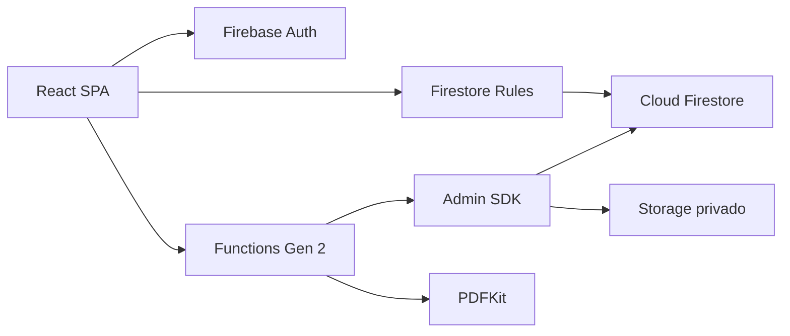

# Arquitectura

## Resumen

La solución es una SPA React 19/Vite sin SSR. Firebase Authentication restaura
la sesión y `users/{uid}` determina estado y rol. La UI nunca muestra contenido
privado hasta terminar ambas comprobaciones.

Firestore atiende CRUD operacional acotado por Rules. Las operaciones que
requieren autoridad —usuarios, folios, emisión, descarga privada, correcciones,
auditoría y notificaciones— se ejecutan en Functions Gen 2 con Admin SDK.

## Límites de confianza

- La UI valida experiencia; Rules y Functions autorizan.
- Roles y estado provienen siempre de `users/{uid}`.
- Totales del navegador son informativos; emisión recalcula desde items.
- PDF y `storagePath` nunca se entregan al frontend. La descarga devuelve bytes
  tras validar actor, asignación, estado, MIME, firma y tamaño.
- `operatorIds` es un ACL de datos maestros mantenido por el trigger de
  asignaciones. Evita exponer el directorio completo a operadores.

## Módulos

- `src/app`, `layouts`, `components`: composición, rutas y UI.
- `src/features`: autenticación, datos maestros, solicitudes, cotizaciones,
  usuarios, catálogos, actividad, configuración y manual.
- `src/models`, `utils`: contratos, Zod, transiciones y cálculo puro.
- `src/services/firebase`: SDK modular, emuladores y acceso limitado.
- `functions/src`: auth, usuarios, quotes, documents, audit y shared.
- `scripts`: semilla segura, validación de entorno y migración dry-run.

## Rendimiento

Las rutas se cargan con `React.lazy`, Firebase y React se separan en chunks y
las consultas tienen límites. Los índices cubren asignación, estado, actividad y
ACL. Los textos grandes y mapas de auditoría se excluyen de índices.
