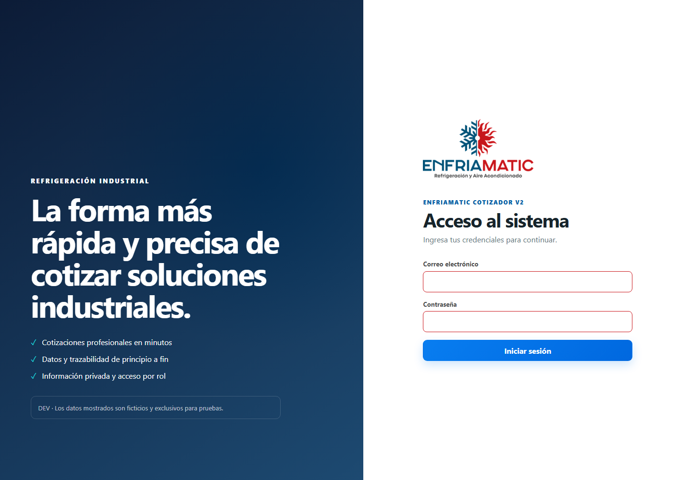
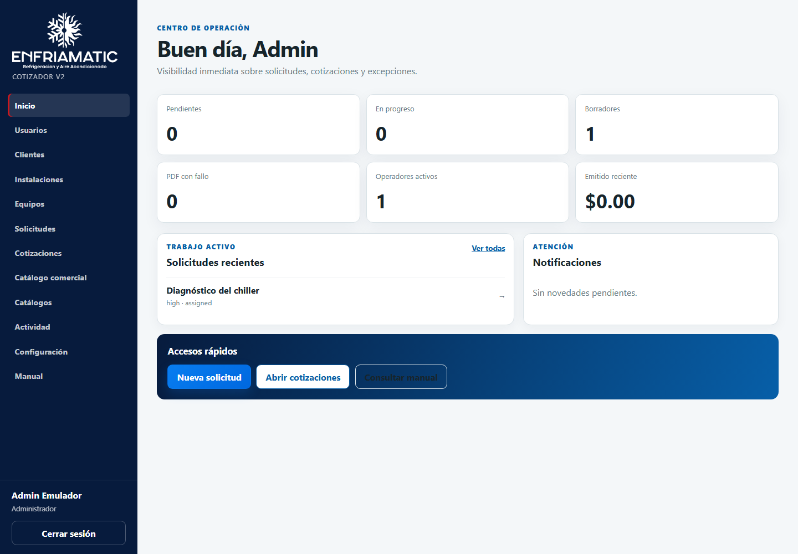
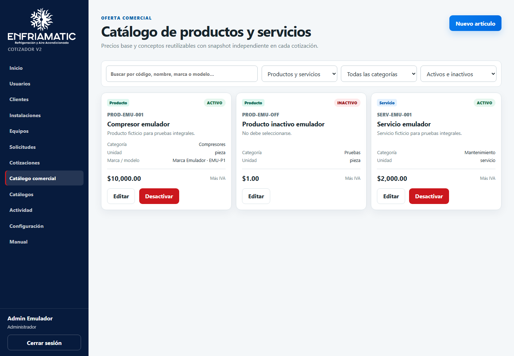
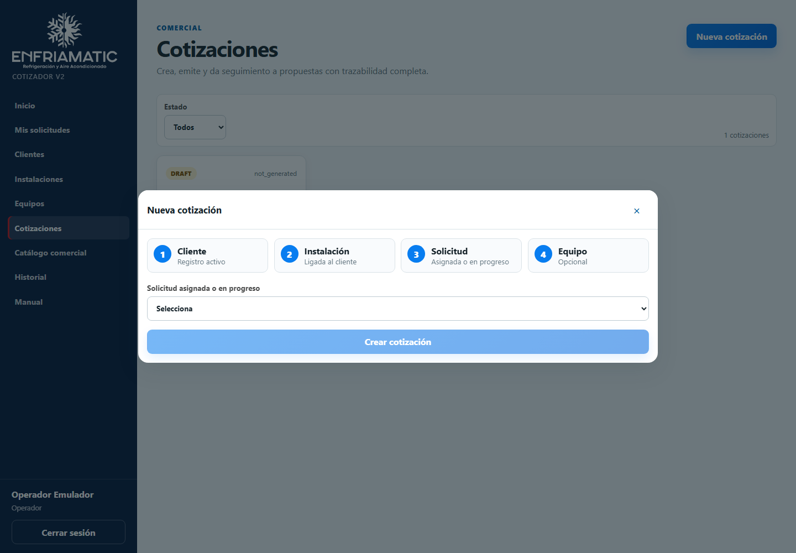

# Manual de administrador — Enfriamatic Cotizador V2

Este manual corresponde al entorno DEV de México. La aplicación opera en español (`es-MX`), usa MXN e IVA predeterminado de 16 %. Los datos de demostración son ficticios.

## 1. Acceso seguro

Inicia sesión con tu cuenta individual. Confirma que el panel muestre **Administrador**. No compartas credenciales, tokens ni códigos de recuperación. Cierra sesión en equipos compartidos. Si el perfil aparece inactivo, pendiente o suspendido, otro administrador debe revisar su estado; nunca se corrige cambiando contraseñas para “probar”.

## 2. Usuarios, roles y estados

En **Usuarios** crea cuentas internas mediante la función protegida. Usa únicamente `admin` u `operator` y uno de los estados `active`, `inactive`, `pending` o `suspended`. Una cuenta inactiva no accede al dominio. No reutilices identidades, no crees cuentas compartidas y no edites perfiles directamente en Firestore.

## 3. Clientes

Registra el cliente antes de cualquier instalación. Captura nombre y contacto; agrega información fiscal sólo cuando esté confirmada. Inactiva registros que ya no deban usarse. La eliminación física está bloqueada para conservar historial.

## 4. Instalaciones

Cada instalación pertenece a un cliente. Selecciona el cliente correcto, tipo de sitio, dirección mexicana y contacto operativo. Revisa la relación antes de registrar equipos o solicitudes.

## 5. Equipos

Registra el equipo ligado a cliente e instalación. Completa categoría, marca, modelo, serie, capacidad y refrigerante sólo con datos confirmados. Usa estados activo, inactivo o retirado sin borrar el historial.

## 6. Catálogo comercial

**Catálogo comercial** contiene productos y servicios; permanece separado de los catálogos genéricos.

1. Pulsa **Nuevo artículo**.
2. Captura un código único normalizado; después no podrá cambiar.
3. Define tipo, nombre, descripción, categoría, unidad, marca/modelo opcionales, precio base, condición de IVA y estado.
4. Usa búsqueda y filtros para revisar el resultado.
5. Desactiva artículos obsoletos. No se borran si se usaron; las cotizaciones previas conservan su snapshot.

El precio se representa como número decimal compatible con los cálculos existentes. No existe inventario ni stock.

## 7. Catálogos genéricos

**Catálogos** contiene unidades, prioridades, tipos y textos operativos. No agregues allí productos ni servicios. Usa valores estables y revisa dependencias antes de inactivar una opción.

## 8. Solicitudes y asignación

Crea una solicitud con cliente, instalación, equipo opcional, título, descripción y prioridad. Asigna un operador activo. La secuencia operativa es `pending → assigned → in_progress → completed`; la cancelación sólo procede desde estados permitidos. La asignación genera notificación.

## 9. Nueva cotización

En **Cotizaciones** pulsa **Nueva cotización**. Debe existir una solicitud `assigned` o `in_progress`; el sistema toma de ella cliente, instalación, equipo opcional y operador. No se permiten cotizaciones libres. Si no hay solicitud válida, usa los accesos a Clientes, Instalaciones y Solicitudes indicados por la interfaz.

## 10. Partidas, descuentos e IVA

Agrega productos o servicios desde el catálogo lateral. El sistema copia código, tipo, nombre, descripción, unidad, marca, modelo, precio, condición fiscal y un snapshot. Editar la partida nunca cambia el catálogo; editar o desactivar el catálogo nunca modifica la partida histórica. También puedes crear una partida manual.

Revisa cantidad, precio unitario, descuento porcentual o fijo, condición de IVA, subtotal original, descuento, subtotal neto, IVA 16 % y total MXN. El descuento no puede exceder el importe de la línea.

## 11. Vista previa, emisión y PDF

Usa **Vista previa** para confirmar cliente, instalación, partidas, vigencia y totales. **Generar PDF y emitir** recalcula en backend, asigna folio anual, crea el PDF privado y bloquea la cotización. Si falla, el borrador permanece editable y el proceso puede reintentarse. Descarga sólo mediante **Descargar PDF**; Storage no es público.

## 12. Seguimiento comercial

Las transiciones válidas son `issued → sent`, `sent → accepted`, `sent → rejected`, `issued → cancelled` y `sent → cancelled`. Administrador u operador asignado puede marcar enviada; sólo administrador acepta, rechaza o cancela. Rechazo y cancelación exigen motivo. Cada cambio guarda actor, fecha, estado anterior/nuevo, auditoría y notificación. Los estados terminales no regresan y la cotización no se desbloquea.

`expired` permanece reservado en los contratos, pero no aparece como acción de este hito.

## 13. Correcciones

Nunca edites una emisión. Abre una cotización emitida o con seguimiento comercial y pulsa **Crear corrección**. Se crea una solicitud y un borrador relacionados, con nueva revisión y nuevo folio al emitir. Verifica la referencia al documento original.

## 14. Auditoría

**Actividad** muestra acciones sensibles, actor, rol, recurso, fecha y relaciones con solicitud/cotización. Los registros son append-only y el navegador no puede crearlos, cambiarlos ni borrarlos.

## 15. Notificaciones

Revisa asignaciones, emisiones y transiciones en el panel y Actividad. Marca una notificación como leída sólo después de atenderla. Confirma el recurso relacionado antes de actuar.

## 16. Configuración

En **Configuración** valida perfil de empresa, IVA 16 %, moneda MXN, vigencia, prefijo, condiciones y marca de agua DEV. No inventes datos fiscales ni retires la marca de prueba en DEV.

## 17. Errores frecuentes

- **No hay solicitud válida:** completa cliente/instalación, asigna operador e inicia la solicitud cuando corresponda.
- **Permiso denegado:** confirma rol activo, asignación y que el recurso esté dentro del alcance.
- **Código duplicado:** usa un código comercial diferente; el código existente no se edita.
- **Artículo inactivo:** actívalo como administrador sólo si debe volver a ofrecerse.
- **PDF fallido:** revisa Actividad, conserva el borrador y reintenta; no dupliques la cotización.
- **Totales inesperados:** revisa cantidad, descuento, IVA de cada partida y vista previa.

## 18. Recuperación

Registra folio, UID del actor, hora y acción sin compartir secretos. Revisa Actividad y estado del documento. Para una liberación fallida usa [rollback.md](./rollback.md): Hosting, Rules, índices y Functions se restauran por recurso; la semilla sólo se elimina por doble marca; usuarios reales y PDF oficiales se conservan.
