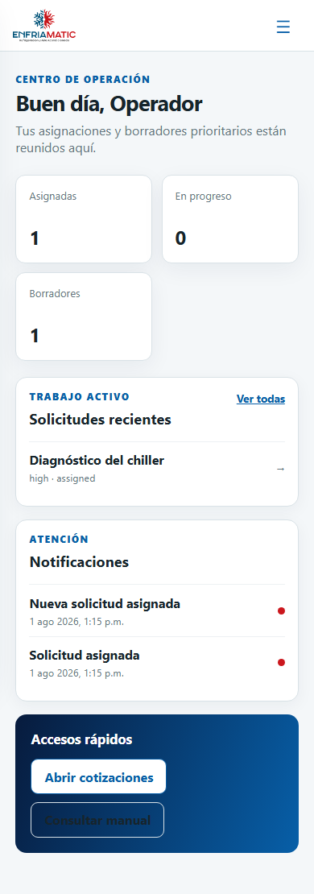

# Manual de operador — Enfriamatic Cotizador V2

La aplicación DEV opera en español (`es-MX`), moneda MXN e IVA predeterminado de 16 %. Usa únicamente tu cuenta individual.

## 1. Acceso y panel

Inicia sesión y confirma el rol **Operador**. El panel reúne tus solicitudes asignadas, trabajos en progreso, borradores, emisiones y actividad reciente. En móvil usa el menú y los accesos rápidos. Si el perfil está pendiente, inactivo o suspendido, contacta al administrador.

## 2. Solicitudes asignadas e inicio de trabajo

En **Mis solicitudes** verás sólo recursos asignados a tu UID. Abre la solicitud, confirma cliente, instalación, equipo, prioridad y alcance, y pulsa **Iniciar solicitud** para avanzar de `assigned` a `in_progress`. No trabajes sobre una solicitud de otro operador.

## 3. Clientes, instalaciones y equipos

Consulta datos vinculados con tus asignaciones. Verifica identidad del cliente, dirección del sitio y datos técnicos del equipo. Si hay un error, solicita al administrador corregir el dato maestro; el operador no lo altera.

## 4. Nueva cotización

Abre **Cotizaciones**, pulsa **Nueva cotización** y selecciona una solicitud `assigned` o `in_progress`. El sistema toma cliente, instalación y equipo opcional. Si no aparece, confirma que la solicitud esté asignada a ti y en estado permitido. No existen cotizaciones libres.

## 5. Catálogo comercial

El catálogo muestra sólo artículos activos. Busca por código, nombre, marca o modelo y filtra productos/servicios. Al agregar un artículo se copia un snapshot; los cambios posteriores del catálogo no afectan tu partida.

## 6. Partidas de catálogo y manuales

Después de agregar un artículo puedes editar cantidad, descripción, precio o descuento dentro de la cotización. Esto no cambia el catálogo. Usa **Partida manual** sólo cuando el concepto no exista; captura unidad, descripción, precio y condición de IVA.

## 7. Descuentos, IVA y totales

El descuento puede ser porcentaje o monto fijo y nunca debe superar la línea. Verifica subtotal original, descuento, subtotal neto, IVA 16 % y total MXN. Confirma si cada partida está gravada.

## 8. Vista previa, emisión y descarga

Revisa cliente, instalación, conceptos, precios, vigencia y total en **Vista previa**. Pulsa **Generar PDF y emitir** y espera el mensaje de éxito. La cotización recibe folio, queda bloqueada y el PDF se mantiene privado. Descárgalo sólo con el botón autorizado.

## 9. Marcar enviada

Cuando la propuesta realmente se haya enviado al cliente, abre la cotización emitida y pulsa **Marcar enviada**. Sólo el operador asignado puede hacerlo. Aceptación, rechazo y cancelación corresponden al administrador.

## 10. Correcciones

No edites una cotización emitida. Usa **Crear corrección** para generar una solicitud y borrador relacionados. Trabaja sobre el nuevo borrador; el original permanece bloqueado.

## 11. Historial y notificaciones

Consulta **Historial/Actividad** y las notificaciones del panel. Usa folio y solicitud para identificar cada caso. Marca un aviso como leído sólo después de atenderlo.

## 12. Errores frecuentes

- **Solicitud no visible:** no está asignada a ti o no tiene estado válido.
- **No puedes cotizar:** inicia la solicitud o pide al administrador revisar cliente/instalación/asignación.
- **Artículo no aparece:** está inactivo; solicita revisión al administrador.
- **Permiso denegado:** el recurso está fuera de tu alcance o tu perfil no está activo.
- **PDF fallido:** conserva el borrador y reintenta; no crees duplicados.
- **Conexión interrumpida:** vuelve a cargar y confirma la persistencia antes de repetir una acción.

## 13. Restricciones del rol

El operador no administra usuarios, configuración, catálogos genéricos ni catálogo comercial; no ve datos fuera de sus asignaciones; no acepta, rechaza ni cancela cotizaciones; no edita documentos emitidos; no escribe auditoría ni accede directamente a Storage. Estas restricciones protegen la trazabilidad.
